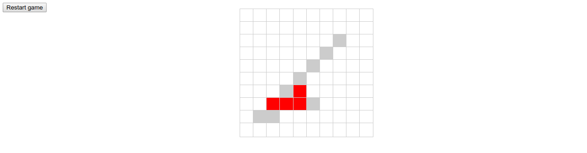

# battle-sea



##### Note:

Laravel 5.6 used to route and organize controllers code.

Application use session storage to keep generated game field while playing game.

Every page refresh will recreate game field and ships in new positions.

*DEBUG MODE*

To view generated ship info of field, add '?debug=1' to browser query string.
It will show you places of ships (2), marked cells (1) around ships and empty cells (0).

*JS and CSS*

No javascript frameworks used.
To my regret I do not have preconfigured javascript and UI environment for pet-projects to get and use it simply. 
Configuration of usual JS stack (react, redux with actions, reducers e.t.c.) is fat over engineering, it take quite a few time to take balanced solution, that is reason to skip it just now.

Needed JS functions is very simple, it takes only a few lines of code and not require any libraries or frameworks.

#### Requirements:
- php7.2-fpm (on 9000 port listen in my case)
- chrome or firefox browser
- nginx or apache web-server

#### Nginx localhost server configuration to php-fpm listen on port 9000

file _/etc/nginx/sites-enabled/localhost_
```text
server {
    listen 8080;

    root /var/www/battle-sea/public;
    index index.php;
    
    # Make site accessible from http://localhost/
    server_name localhost;
    charset utf-8;
    
    location / {
        try_files $uri $uri/ /index.php?$query_string;
    }
    
    location ~ \.php {
        fastcgi_param SCRIPT_FILENAME $document_root$fastcgi_script_name;
        
        fastcgi_split_path_info ^(.+\.php)(/.+)$;
        fastcgi_pass 127.0.0.1:9000;
        fastcgi_index index.php;
        include fastcgi_params;
    }
}
```
